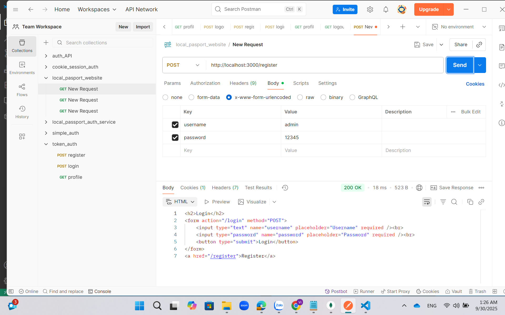
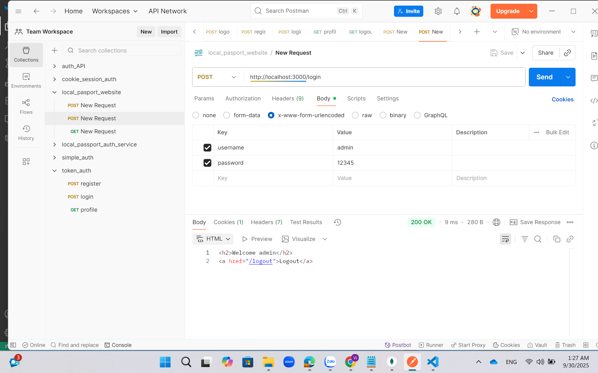
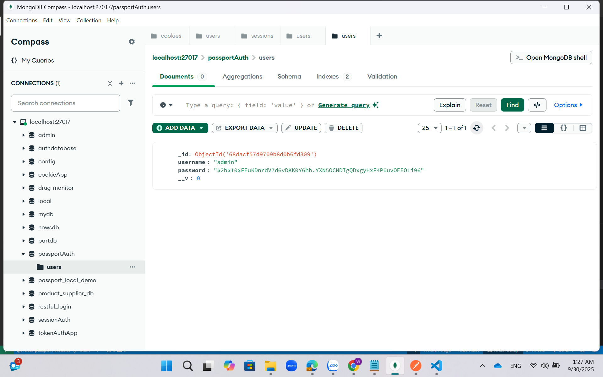
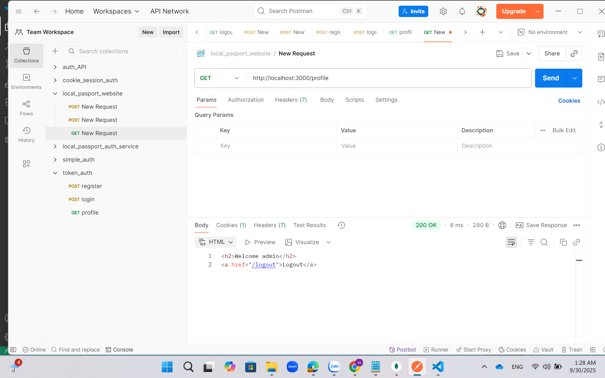
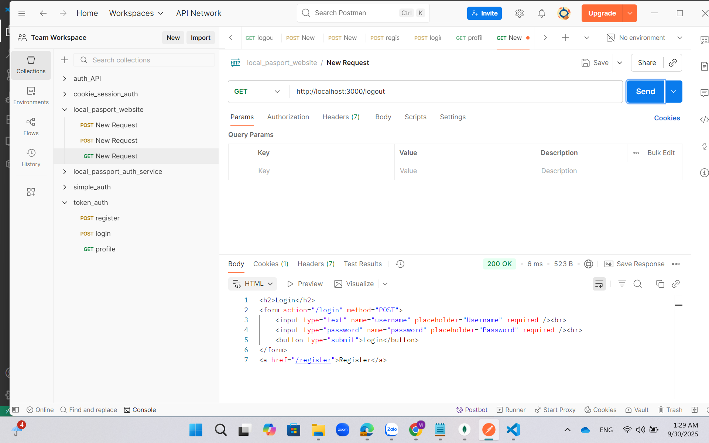

# User Authentication System (Node.js + MongoDB)

Demo project về **Authentication với Register/Login/Profile/Logout** dùng Node.js + MongoDB.  
Ứng dụng minh họa các bước đăng ký, đăng nhập, xem thông tin user, profile và đăng xuất.

---

## How to run
```bash
npm install
node app.js
```
⚠️ Lưu ý: MongoDB phải chạy trước (local hoặc docker).  
Ứng dụng mặc định chạy ở: [http://localhost:3000](http://localhost:3000)

---

## Test Account
```
username: testuser
password: 12345
```

---

## Endpoints & How to test (POSTMAN)

### Register
POST `http://localhost:3000/register`  
Body JSON:
```json
{ "username": "testuser", "password": "12345" }
```
Expected: Tạo user mới.  


---

### Login
POST `http://localhost:3000/login`  
Body JSON:
```json
{ "username": "testuser", "password": "12345" }
```
Expected: Đăng nhập thành công, trả về session/cookie.  


---

### Xem thông tin User
GET `http://localhost:3000/user`  
Expected: Trả về thông tin cơ bản của user đã login.  


---

### Profile
GET `http://localhost:3000/profile`  
Expected: Hiển thị thông tin chi tiết user.  


---

### Logout
GET `http://localhost:3000/logout`  
Expected: Xóa session/cookie, đăng xuất thành công.  


---

## Screenshots
(Ảnh nằm trong thư mục `public/results/` đã commit)

---

## Commit & Push
```bash
git add .
git commit -m "Add README with user authentication flow + screenshots"
git push origin main
```